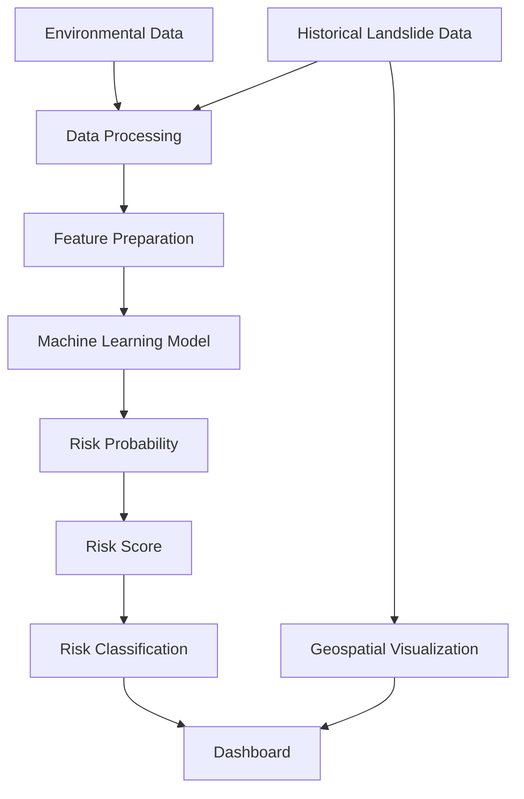
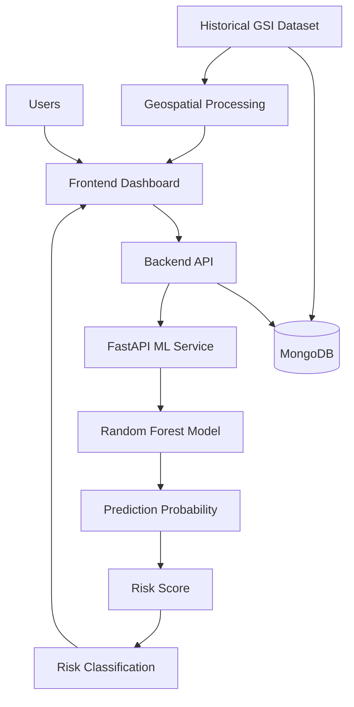
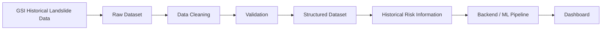
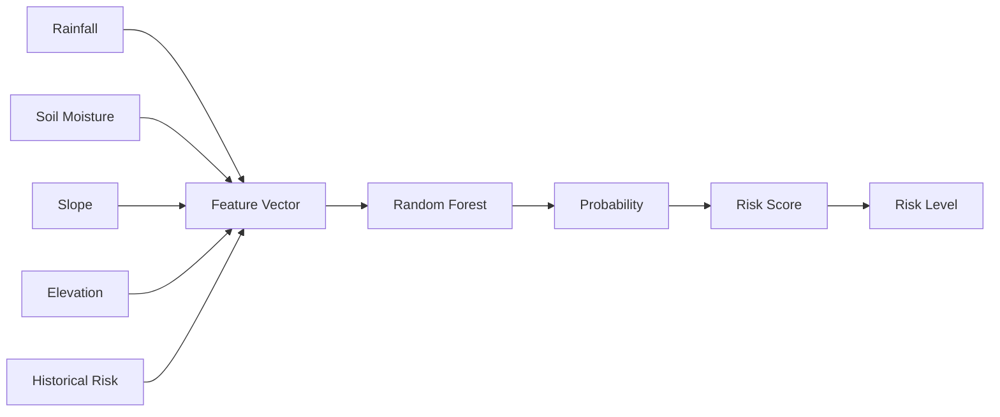
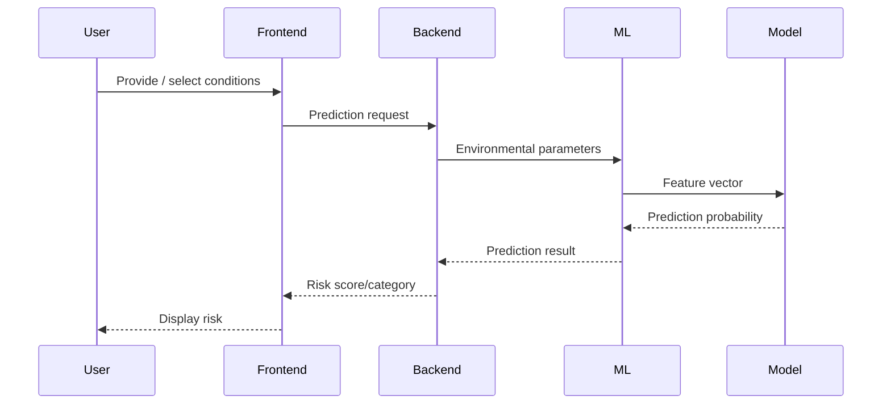
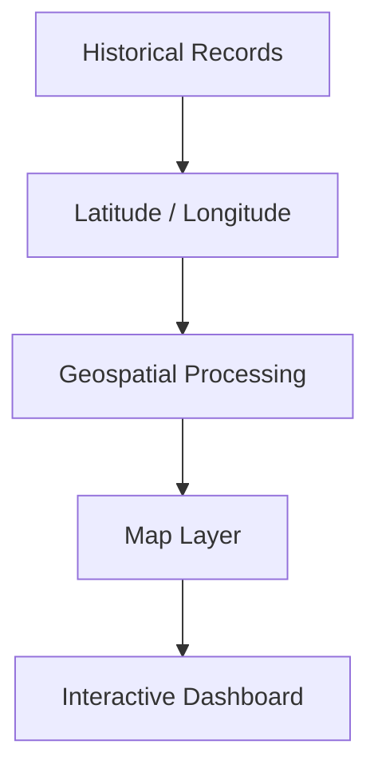
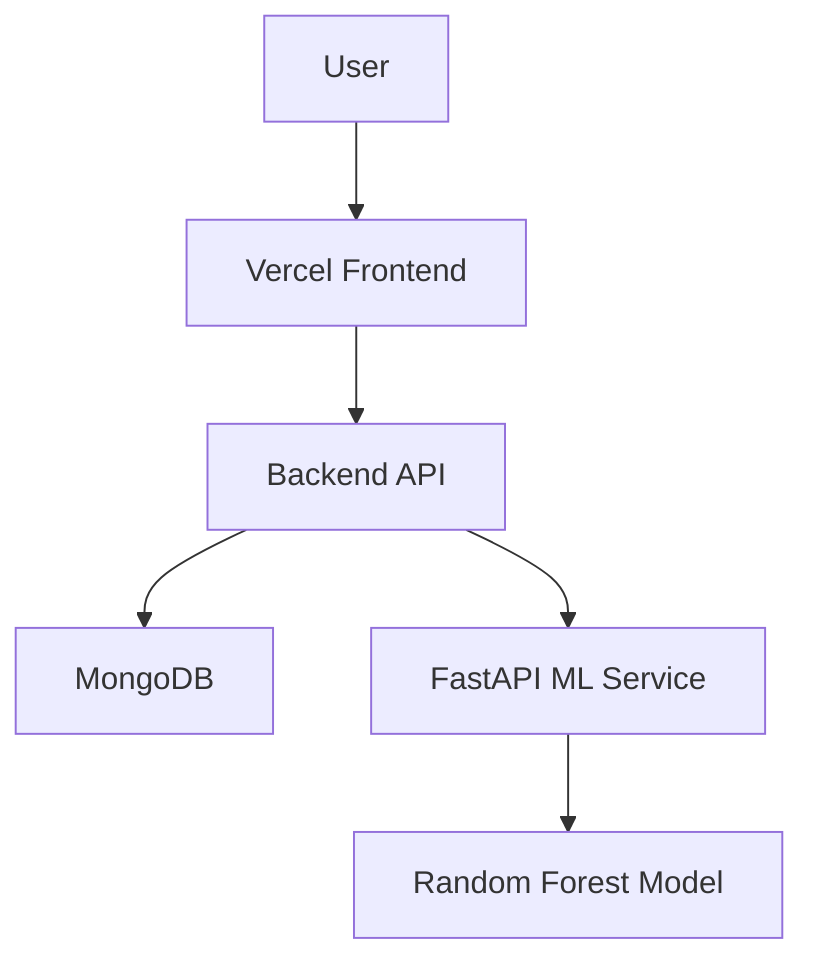
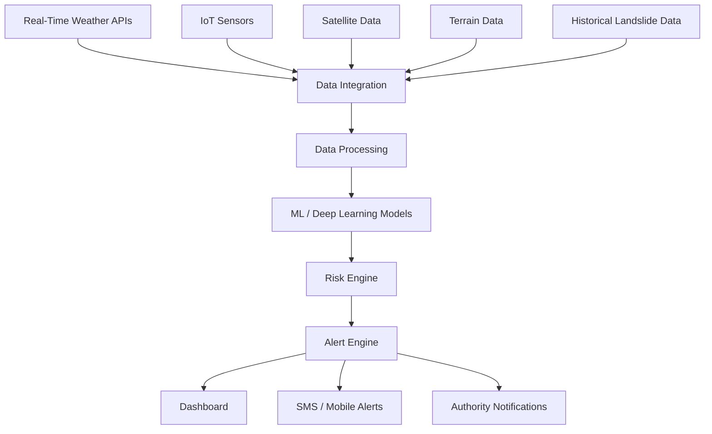
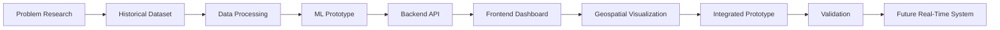

# GiriDrishti AI

## Complete Project Documentation

**AI-Based Early Warning and Landslide Risk Monitoring System**

---

## 1. Project Information

| Field                | Details                       |
| -------------------- | ----------------------------- |
| Project Name         | GiriDrishti AI                |
| Event                | Smart India Hackathon 2026    |
| Problem Statement ID | SIH26001                      |
| Theme                | Disaster Management           |
| Team                 | TechVanguard                  |
| Institution          | Pragati Engineering College   |
| Project Type         | Academic / Research Prototype |

---

# 2. Abstract

Landslides are among the major natural hazards affecting mountainous and hilly regions. They can result in loss of life, infrastructure damage, transportation disruption, and significant economic losses.

GiriDrishti AI is an AI-assisted landslide risk monitoring and early-warning prototype designed to combine historical landslide information with environmental and geographical parameters.

The system uses a machine-learning pipeline to analyze factors such as rainfall, soil moisture, slope, elevation, and historical risk. A Random Forest model generates a risk probability that can be transformed into a risk score and classification.

The platform provides an interactive dashboard for visualizing historical landslide information, environmental conditions, and model-generated risk assessments.

The objective is to provide an accessible decision-support platform that can assist disaster-management stakeholders in understanding potential landslide risk.

---

# 3. Introduction

Landslides occur when masses of soil, rock, or debris move down a slope under the influence of gravity.

Several factors can contribute to landslide occurrence:

* Heavy rainfall
* Soil saturation
* Steep slopes
* Geological conditions
* Elevation and terrain
* Previous landslide activity
* Human activities
* Changes in land use

Monitoring these factors individually can make it difficult to obtain a unified understanding of risk.

GiriDrishti AI attempts to address this challenge by bringing historical information, environmental parameters, machine learning, and visualization together in a single platform.

---

# 4. Problem Statement

The project addresses the need for an AI-assisted system capable of:

1. Collecting relevant environmental information.
2. Utilizing historical landslide records.
3. Combining multiple risk factors.
4. Estimating potential landslide risk.
5. Representing risk information visually.
6. Supporting monitoring and preparedness.

---

# 5. Objectives

The major objectives are:

* Develop an AI-assisted landslide risk monitoring system.
* Utilize historical landslide information.
* Incorporate environmental parameters.
* Implement machine-learning based risk estimation.
* Provide an interactive monitoring dashboard.
* Support geospatial visualization.
* Present predictions in an understandable form.
* Provide a foundation for future real-time early-warning capabilities.

---

# 6. Proposed Solution

The proposed platform consists of several interconnected components.



---

# 7. System Architecture



---

# 8. Data Architecture



---

# 9. Historical Dataset

Historical landslide information was obtained from the Geological Survey of India.

The project extracted and processed information from the available landslide inventory for prototype development.

The original extraction contained approximately:

**35,972 records**

After cleaning and processing:

**35,772 records**

The processed dataset contains fields including:

```text
slide_id
state
latitude
longitude
movement_type
history
source_text
```

---

# 10. Dataset Processing

The dataset processing workflow was:

```text
GSI Source
   ↓
PDF Extraction
   ↓
Raw CSV
   ↓
Duplicate / Invalid Record Handling
   ↓
Data Cleaning
   ↓
Coordinate Validation
   ↓
Structured Dataset
   ↓
Geospatial Analysis
```

The processed dataset should not be interpreted as a replacement for the authoritative original source.

---

# 11. Machine Learning Methodology

The prototype uses a **Random Forest** model.

Random Forest is an ensemble machine-learning method that combines multiple decision trees to produce a prediction.

Advantages relevant to this prototype include:

* Ability to model nonlinear relationships
* Handling of multiple input features
* Robustness compared with an individual decision tree
* Suitable for tabular datasets
* Ability to estimate class probabilities in classification settings

---

# 12. Model Inputs

The prediction service accepts the following conceptual features:

| Feature         | Meaning                           |
| --------------- | --------------------------------- |
| Rainfall        | Rainfall condition                |
| Soil Moisture   | Soil moisture condition           |
| Slope           | Terrain slope                     |
| Elevation       | Elevation of location             |
| Historical Risk | Historical landslide-related risk |

---

# 13. Prediction Architecture



---

# 14. Calculation Architecture

The conceptual calculation pipeline is:

```text
Input Features
       ↓
Feature Validation
       ↓
Feature Vector
       ↓
Random Forest
       ↓
Prediction Probability
       ↓
Probability × 100
       ↓
Risk Score
       ↓
Risk Classification
```

Conceptually:

```text
Risk Score = Prediction Probability × 100
```

The actual thresholds used by the application should be treated as implementation-specific.

---

# 15. Risk Classification

The dashboard can represent model results using categories such as:

```text
LOW
MEDIUM
HIGH
CRITICAL
```

A classification system helps convert numerical predictions into information that is easier for users to understand.

However, these labels are application-level classifications and should not be interpreted as official government hazard declarations.

---

# 16. Prediction Sequence



---

# 17. Geospatial Architecture

Historical records containing latitude and longitude can be visualized geographically.



This allows users to inspect the geographic distribution of historical landslide events.

---

# 18. User Workflow

```text
Open Dashboard
      ↓
Select / View Location
      ↓
View Historical Information
      ↓
Enter / Obtain Environmental Parameters
      ↓
Request Prediction
      ↓
ML Model Processes Inputs
      ↓
Risk Score Generated
      ↓
Risk Category Displayed
      ↓
User Interprets Alongside Authoritative Information
```

---

# 19. Technology Stack

## Frontend

* React
* Vite
* JavaScript
* HTML
* CSS
* Tailwind CSS

## Backend

* Node.js
* Express.js
* REST API

## Database

* MongoDB
* Mongoose

## Machine Learning

* Python
* FastAPI
* Scikit-learn
* Random Forest
* Pandas
* NumPy
* Joblib

---

# 20. API Architecture

```text
Frontend
   │
   ▼
Backend REST API
   │
   ├── Historical Data
   ├── Locations
   ├── Dashboard Data
   └── ML Prediction
          │
          ▼
     FastAPI Service
          │
          ▼
    Random Forest Model
```

---

# 21. Example Prediction Request

```json
{
  "rainfall": 120,
  "soilMoisture": 65,
  "slope": 35,
  "elevation": 850,
  "historicalRisk": 0.8
}
```

Example conceptual response:

```json
{
  "riskScore": 78,
  "riskLevel": "HIGH"
}
```

The example is illustrative. The deployed implementation should be treated as the authoritative API specification.

---

# 22. Frontend Architecture

```text
User Interface
      │
      ├── Dashboard
      ├── Risk Monitoring
      ├── Historical Data
      ├── Maps
      ├── Analytics
      └── Prediction Interface
              │
              ▼
          API Layer
```

---

# 23. Backend Architecture

```text
Client Request
      ↓
Express Server
      ↓
Routes
      ↓
Controllers / Services
      ↓
Database / ML Service
      ↓
Response
```

---

# 24. ML Service

The machine-learning service is implemented using FastAPI.

Conceptual architecture:

```text
FastAPI
   │
   ├── Request Validation
   │
   ├── Feature Preparation
   │
   ├── Model Loading
   │
   ├── Prediction
   │
   └── Response Generation
```

The model is stored as:

```text
model.joblib
```

---

# 25. Project Directory Structure

```text
GiriDrishti-AI/
│
├── README.md
├── LICENSE
├── DISCLAIMER.md
├── SECURITY.md
├── THIRD_PARTY_NOTICES.md
│
├── docs/
│   └── PROJECT_DOCUMENTATION.md
│
├── frontend/
│
├── backend/
│
├── ml-service/
│
├── data/
│   ├── gsi_landslide_inventory.csv
│   └── gsi_landslide_clean.csv
│
└── ...
```

---

# 26. Installation

## Frontend

```bash
cd frontend
npm install
npm run dev
```

## Backend

```bash
cd backend
npm install
npm start
```

## ML Service

```bash
cd ml-service

python -m venv venv
venv\Scripts\activate

pip install -r requirements.txt

uvicorn main:app --reload --port 8000
```

---

# 27. Environment Variables

Sensitive information should be stored using environment variables.

Example:

```env
MONGO_URI=your_mongodb_connection_string
JWT_SECRET=your_secret
API_URL=your_backend_url
ML_SERVICE_URL=your_ml_service_url
```

Never commit real credentials to GitHub.

---

# 28. Deployment Architecture



---

# 29. Security Architecture

Security practices include:

* Environment variables
* API validation
* Secure database credentials
* Input validation
* Authentication where required
* Restricted database access
* No hard-coded secrets
* Secure production configuration

---

# 30. Privacy Considerations

The prototype should avoid collecting unnecessary personal information.

Where user information is introduced in future versions:

* Collect only required data.
* Protect stored information.
* Restrict access.
* Avoid exposing sensitive information through APIs.
* Follow applicable privacy requirements.

---

# 31. Responsible AI

Machine-learning predictions are probabilistic estimates.

Important limitations include:

* Incomplete environmental information
* Historical dataset limitations
* Possible measurement errors
* Model bias
* False positives
* False negatives
* Changing geological conditions
* Limited representation of rare events

Therefore, model output should be interpreted alongside authoritative information.

---

# 32. False Positives and False Negatives

### False Positive

The model may indicate elevated risk even though a landslide does not occur.

Possible consequences include:

* Unnecessary investigation
* Additional monitoring
* Increased resource usage

### False Negative

The model may indicate lower risk even though a landslide occurs.

This is particularly important in safety-critical applications.

Future versions should therefore focus strongly on validation, calibration, additional data sources, and conservative safety design.

---

# 33. Scalability

The architecture can be extended to support larger deployments.

Potential scaling approaches include:

```text
Load Balancer
      ↓
Multiple Backend Instances
      ↓
Database Cluster
      ↓
ML Service Instances
      ↓
Caching / Queue
      ↓
Monitoring Infrastructure
```

---

# 34. Future Architecture



---

# 35. Future Enhancements

Potential improvements include:

1. Real-time rainfall integration.
2. Real-time soil moisture sensors.
3. Satellite imagery.
4. Remote sensing.
5. Digital elevation models.
6. Time-series forecasting.
7. IoT-based monitoring.
8. Mobile application.
9. SMS alerts.
10. Explainable AI.
11. Automated anomaly detection.
12. Regional risk maps.
13. Model ensemble techniques.
14. Integration with authoritative disaster-management systems.

---

# 36. Social Impact

Potential benefits include:

* Improved risk awareness
* Better preparedness
* Faster identification of potentially vulnerable locations
* Support for disaster-management planning
* Improved accessibility of historical information
* Support for infrastructure monitoring
* Potential reduction in response time when integrated with appropriate authoritative systems

The actual societal impact would depend on validation, deployment, operational integration, and responsible use.

---

# 37. Target Users

* Disaster management authorities
* District administration
* NDRF
* SDRF
* Highway authorities
* Railway authorities
* Local administration
* Researchers
* Communities
* Infrastructure planners

---

# 38. Dataset Attribution

Historical landslide information was obtained from the Geological Survey of India (GSI), Government of India.

The project does not claim ownership of the original GSI information.

Users should verify the original source and applicable terms before redistribution or operational use.

---

# 39. Project Ownership

The project's original source code and original project materials are developed by the project team, subject to:

* Institution policies
* Smart India Hackathon rules
* Third-party licenses
* Dataset terms
* Applicable intellectual-property requirements

External datasets and libraries remain under their respective ownership and licenses.

---

# 40. Testing Strategy

Testing should cover:

### Frontend

* UI rendering
* Form validation
* API integration
* Map rendering
* Responsive behavior

### Backend

* API responses
* Input validation
* Error handling
* Database connectivity

### ML Service

* Input validation
* Prediction generation
* Boundary values
* Invalid inputs
* Model loading

### Integration

* Frontend → Backend
* Backend → Database
* Backend → ML service
* ML response → Dashboard

---

# 41. Error Handling

Potential errors include:

* Invalid input
* Missing fields
* API unavailable
* Database unavailable
* ML service unavailable
* Invalid coordinates
* Model loading failure

The application should return meaningful error messages without exposing sensitive implementation details.

---

# 42. Ethical Considerations

Because landslide prediction can involve safety-related decisions:

* Predictions must not be presented as guaranteed.
* Users should be informed about uncertainty.
* Official authorities should remain the source for emergency decisions.
* Model limitations should be documented.
* Data provenance should be maintained.
* Future operational deployment should undergo appropriate validation.

---

# 43. Project Development Roadmap



---

# 44. Project Vision

The long-term vision is to develop a scalable landslide intelligence platform that can combine multiple data sources and provide timely risk information to relevant stakeholders.

```text
Historical Data
       +
Environmental Data
       +
Geospatial Data
       +
Machine Learning
       ↓
Risk Intelligence
       ↓
Early Warning Support
       ↓
Better Preparedness
       ↓
Resilient Communities
```

---

# 45. Conclusion

GiriDrishti AI demonstrates how machine learning, historical landslide information, environmental parameters, and geospatial visualization can be combined into a unified landslide-risk monitoring prototype.

The current system establishes a foundation for future integration with real-time sensors, weather APIs, satellite imagery, advanced machine-learning models, and automated notification systems.

The project is intended to support awareness, research, monitoring, and preparedness while recognizing that operational disaster decisions require authoritative data, expert assessment, and appropriate validation.

---

# 46. Team

## TechVanguard

**Pragati Engineering College**

| # | Name                        | Roll Number |
| - | --------------------------- | ----------- |
| 1 | Ramesh Netheti              | 25A31A05IG  |
| 2 | Gullipalli Durga Sri Charan | 25A31A05HT  |
| 3 | Vinakoti Naga Chandeeswar   | 25A31A05IV  |
| 4 | Sayyed Hafeeja Sulthana     | 25A31A05HF  |
| 5 | Devadi Geetha Sai Sri       | 25A31A05GR  |
| 6 | Alugolu Sai Devi Sri        | 25A31A05GJ  |

---

# 47. References

* Geological Survey of India — Landslide-related geological information and inventory resources.
* Scikit-learn documentation.
* FastAPI documentation.
* React documentation.
* Node.js documentation.
* Express.js documentation.
* MongoDB documentation.

---

# 48. Disclaimer

GiriDrishti AI is an academic/research prototype.

The system does not provide guaranteed predictions and should not be treated as an official warning system, geological certification, emergency instruction system, or replacement for qualified professionals.

For safety-critical decisions, users must consult appropriate government authorities, disaster-management agencies, geological experts, and verified emergency information.

---

**GiriDrishti AI — Turning data into landslide risk intelligence.**
