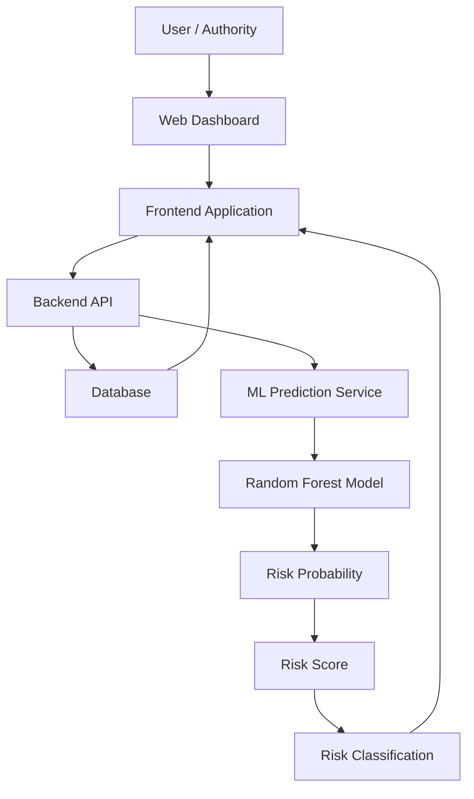
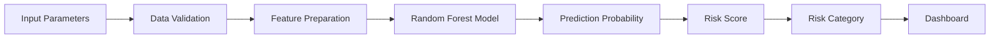
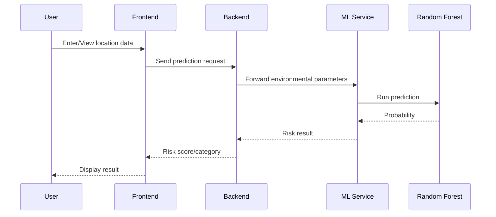

# 🏔️ GiriDrishti AI

### AI-Based Early Warning and Landslide Risk Monitoring System

> **Smart India Hackathon 2026 — Disaster Management**
> **Problem Statement ID:** SIH26001
> **Team:** TechVanguard
> **Institution:** Pragati Engineering College

[](https://giri-drishti-ai-9udr.vercel.app/)
[](https://react.dev/)
[](https://nodejs.org/)
[](https://scikit-learn.org/)
[](https://www.mongodb.com/)
[](https://www.python.org/)

---

## 🌐 Live Demo

**GiriDrishti AI:**
https://giri-drishti-ai-9udr.vercel.app/

---

## 📌 Overview

**GiriDrishti AI** is an AI-assisted landslide risk monitoring and early-warning prototype designed to support disaster management in landslide-prone regions.

The system combines:

* Historical landslide information
* Rainfall conditions
* Soil moisture
* Slope
* Elevation
* Historical risk information
* Machine learning-based risk prediction
* Geospatial visualization
* Risk classification
* Interactive monitoring dashboards

The objective is to transform environmental and historical information into an understandable **landslide risk assessment** that can support authorities and communities in monitoring potentially vulnerable areas.

> ⚠️ GiriDrishti AI is an academic/research prototype. Its predictions are estimates and must not be treated as official government warnings or as a replacement for professional geological assessment.

---

# 🎯 Problem Statement

Landslides can cause:

* Loss of life
* Damage to roads and railways
* Destruction of infrastructure
* Disruption of transportation
* Property damage
* Communication failures
* Difficulties in emergency response

Traditional monitoring approaches may depend on manual observation, historical records, weather information, and specialized geological assessments.

There is a need for an integrated system capable of combining multiple environmental and historical factors to provide an accessible indication of changing landslide risk.

---

# 💡 Proposed Solution

GiriDrishti AI provides a unified platform for landslide risk monitoring.

The system processes environmental parameters and historical information and passes them through a machine-learning model.

### Main workflow

```text
Environmental Data
       │
       ├── Rainfall
       ├── Soil Moisture
       ├── Slope
       ├── Elevation
       └── Historical Risk
              │
              ▼
       Data Processing
              │
              ▼
      Machine Learning Model
        (Random Forest)
              │
              ▼
       Risk Probability
              │
              ▼
        Risk Score
              │
              ▼
   Risk Classification
              │
       ┌──────┼──────┐
       ▼      ▼      ▼
      LOW   MEDIUM  HIGH/CRITICAL
              │
              ▼
       Dashboard / Map
              │
              ▼
     Monitoring & Response
```

---

# 🚀 Key Features

## 🌧️ Environmental Risk Analysis

The system considers important factors including:

* Rainfall
* Soil moisture
* Slope
* Elevation
* Historical landslide risk

---

## 🤖 Machine Learning Prediction

A **Random Forest** machine-learning model is used to estimate landslide risk based on the available input parameters.

The ML service is implemented using Python and FastAPI.

---

## 🗺️ Geospatial Analysis

Historical landslide information can be represented geographically to help identify areas with previous landslide activity.

This allows users to understand the spatial distribution of historical events.

---

## 📊 Risk Score

The prediction service generates a risk probability which can be converted into a normalized risk score for dashboard visualization.

Example conceptual scale:

```text
0 ─────────────────────────────── 100
LOW          MEDIUM       HIGH    CRITICAL
```

The exact interpretation of the score depends on the model and application configuration.

---

## 🚨 Risk Classification

The system categorizes predictions into understandable risk levels such as:

* LOW
* MEDIUM
* HIGH
* CRITICAL

These classifications are intended for monitoring and visualization rather than official emergency declarations.

---

## 📈 Interactive Dashboard

The dashboard provides a centralized view of:

* Current risk information
* Historical landslide information
* Environmental parameters
* Risk scores
* Locations
* Prediction results
* Monitoring information

---

# 🏗️ System Architecture



---

# 🧠 Machine Learning Architecture



### Model Inputs

| Feature         | Description                                   |
| --------------- | --------------------------------------------- |
| Rainfall        | Rainfall measurement/input                    |
| Soil Moisture   | Estimated soil moisture condition             |
| Slope           | Terrain slope                                 |
| Elevation       | Elevation of the location                     |
| Historical Risk | Historical landslide-related risk information |

---

# 📚 Historical Dataset

The project uses historical landslide information obtained from the **Geological Survey of India (GSI)**.

The extracted inventory was processed for prototype development.

### Dataset processing

```text
GSI Landslide Inventory
          │
          ▼
       Extraction
          │
          ▼
       Cleaning
          │
          ▼
    Data Validation
          │
          ▼
     Structured CSV
          │
          ▼
   Geospatial Analysis
          │
          ▼
 Historical Risk Layer
```

The processed dataset contains historical landslide records with fields including:

```text
slide_id
state
latitude
longitude
movement_type
history
source_text
```

### Data attribution

**Data Source:** Geological Survey of India (GSI), Government of India.

Historical landslide information has been processed and utilized for academic/research prototype development.

Users should refer to the original GSI source and applicable terms for authoritative information.

---

# 🛠️ Technology Stack

## Frontend

* React
* JavaScript
* HTML
* CSS
* Tailwind CSS
* Vite

## Backend

* Node.js
* Express.js
* REST APIs

## Database

* MongoDB
* Mongoose

## Machine Learning

* Python
* FastAPI
* Scikit-learn
* Random Forest
* Joblib
* Pandas
* NumPy

## Deployment

* Vercel
* Render / compatible backend hosting
* Cloud-based services

---

# 📁 Project Structure

```text
GiriDrishti-AI/
│
├── README.md
├── LICENSE
├── DISCLAIMER.md
├── SECURITY.md
├── THIRD_PARTY_NOTICES.md
│
├── docs/
│   └── PROJECT_DOCUMENTATION.md
│
├── frontend/
│   ├── src/
│   ├── public/
│   ├── package.json
│   └── ...
│
├── backend/
│   ├── routes/
│   ├── controllers/
│   ├── models/
│   ├── middleware/
│   ├── server.js
│   └── ...
│
├── ml-service/
│   ├── model.joblib
│   ├── main.py
│   ├── requirements.txt
│   └── ...
│
├── data/
│   ├── gsi_landslide_inventory.csv
│   └── gsi_landslide_clean.csv
│
└── ...
```

> The exact directory structure may vary depending on the current implementation.

---

# ⚙️ Installation

## 1. Clone the repository

```bash
git clone <YOUR_GITHUB_REPOSITORY_URL>
cd GiriDrishti-AI
```

---

## 2. Frontend Setup

```bash
cd frontend
npm install
npm run dev
```

The frontend will normally be available through the Vite development server.

---

## 3. Backend Setup

Open another terminal:

```bash
cd backend
npm install
npm start
```

Configure the required environment variables before starting the backend.

---

## 4. ML Service Setup

Open another terminal:

```bash
cd ml-service
python -m venv venv
```

### Windows

```bash
venv\Scripts\activate
```

Install dependencies:

```bash
pip install -r requirements.txt
```

Start FastAPI:

```bash
uvicorn main:app --reload --port 8000
```

The ML service will then be available locally through:

```text
http://localhost:8000
```

---

# 🔌 ML Prediction API

### Endpoint

```text
POST /predict
```

### Example request

```json
{
  "rainfall": 120,
  "soilMoisture": 65,
  "slope": 35,
  "elevation": 850,
  "historicalRisk": 0.8
}
```

### Example response

```json
{
  "riskScore": 78,
  "riskLevel": "HIGH"
}
```

> The exact request and response format should always be verified against the deployed/current API implementation.

---

# 🔄 Prediction Flow



---

# 🧮 Risk Calculation Concept

The prediction pipeline can be represented as:

```text
Environmental Parameters
          │
          ▼
     Feature Vector
          │
          ▼
  Random Forest Prediction
          │
          ▼
 Prediction Probability
          │
          ▼
     Risk Score
          │
          ▼
 Risk Classification
```

A normalized score can conceptually be represented as:

```text
Risk Score = Probability × 100
```

The final classification thresholds are application/model dependent and should be documented according to the actual implementation.

---

# 🗺️ Geospatial Analysis

Historical landslide locations are represented using geographic coordinates.

```text
Historical Records
        │
        ▼
Latitude + Longitude
        │
        ▼
Geospatial Processing
        │
        ▼
Map Visualization
        │
        ▼
Identification of
historically affected areas
```

This provides a visual representation of where historical landslide events have occurred.

---

# 👥 Target Users

GiriDrishti AI is designed to support information needs of:

* Disaster management authorities
* District administration
* NDRF / SDRF
* Highway authorities
* Railway authorities
* Local administration
* Researchers
* Communities in vulnerable regions

The system is intended as a decision-support prototype rather than an autonomous emergency-response system.

---

# 🔐 Security

Security considerations include:

* API validation
* Environment-variable based secrets
* Controlled database access
* Input validation
* Separation of frontend/backend services
* Avoiding hard-coded credentials
* Secure deployment configuration

See [`SECURITY.md`](SECURITY.md) for additional information.

---

# 🛡️ Responsible AI

The system should be used with awareness of the limitations of machine-learning predictions.

Important considerations include:

* Predictions depend on input quality.
* Historical data may not represent all future conditions.
* Environmental conditions can change rapidly.
* False positives are possible.
* False negatives are possible.
* Model predictions should be validated against authoritative information.
* The system should not independently issue emergency instructions.

---

# 📜 Documentation

Detailed technical and project documentation is available in:

```text
docs/PROJECT_DOCUMENTATION.md
```

Additional project policies:

* [`LICENSE`](LICENSE)
* [`DISCLAIMER.md`](DISCLAIMER.md)
* [`SECURITY.md`](SECURITY.md)
* [`THIRD_PARTY_NOTICES.md`](THIRD_PARTY_NOTICES.md)

---

# 🔮 Future Enhancements

Potential future development includes:

* Real-time rainfall APIs
* Real-time soil moisture data
* IoT sensor integration
* Satellite imagery
* Remote sensing analysis
* Digital elevation models
* Time-series forecasting
* Advanced geospatial modelling
* Automated alerts
* SMS notifications
* Mobile application
* Government data integration
* Explainable AI
* Regional risk maps
* Historical trend analysis
* Multi-model ensemble prediction
* Real-time monitoring infrastructure

---

# 👨‍💻 Team — TechVanguard

**Pragati Engineering College**

| # | Name                        | Roll Number |
| - | --------------------------- | ----------- |
| 1 | Ramesh Netheti              | 25A31A05IG  |
| 2 | Gullipalli Durga Sri Charan | 25A31A05HT  |
| 3 | Vinakoti Naga Chandeeswar   | 25A31A05IV  |
| 4 | Sayyed Hafeeja Sulthana     | 25A31A05HF  |
| 5 | Devadi Geetha Sai Sri       | 25A31A05GR  |
| 6 | Alugolu Sai Devi Sri        | 25A31A05GJ  |

---

# 🏆 Smart India Hackathon 2026

```text
Event       : Smart India Hackathon 2026
Problem ID  : SIH26001
Theme       : Disaster Management
Project     : GiriDrishti AI
Team        : TechVanguard
Institution : Pragati Engineering College
```

---

# 📄 License

The original software code developed by the project team is intended to be released under the **MIT License**, subject to applicable institutional, competition, and third-party intellectual-property requirements.

Third-party libraries, datasets, maps, APIs, imagery, and other external materials remain subject to their respective licenses and terms.

See [`LICENSE`](LICENSE) and [`THIRD_PARTY_NOTICES.md`](THIRD_PARTY_NOTICES.md).

---

# ⚠️ Disclaimer

GiriDrishti AI is an academic/research prototype.

Its predictions are estimates generated from available data and machine-learning models. They are not official government warnings, geological certifications, emergency instructions, or guarantees of future landslide occurrence.

For safety-critical decisions, users should rely on official disaster-management authorities, geological experts, local administration, and verified emergency information.

See [`DISCLAIMER.md`](DISCLAIMER.md) for the complete disclaimer.

---

# 🌍 Project Vision

The long-term vision of GiriDrishti AI is to develop an intelligent, scalable, and data-driven platform capable of assisting communities and authorities in understanding landslide risk and improving preparedness.

```text
Data
 ↓
Intelligence
 ↓
Risk Awareness
 ↓
Early Warning
 ↓
Preparedness
 ↓
Resilient Communities
```

---

## ⭐ GiriDrishti AI

**AI-assisted landslide risk monitoring for safer and more resilient communities.**
